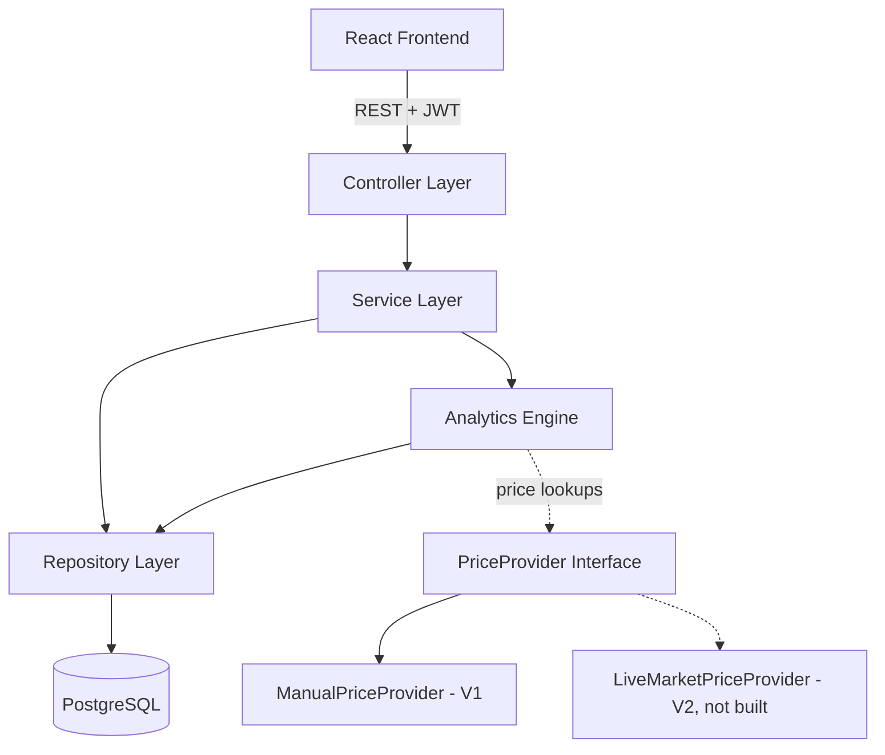
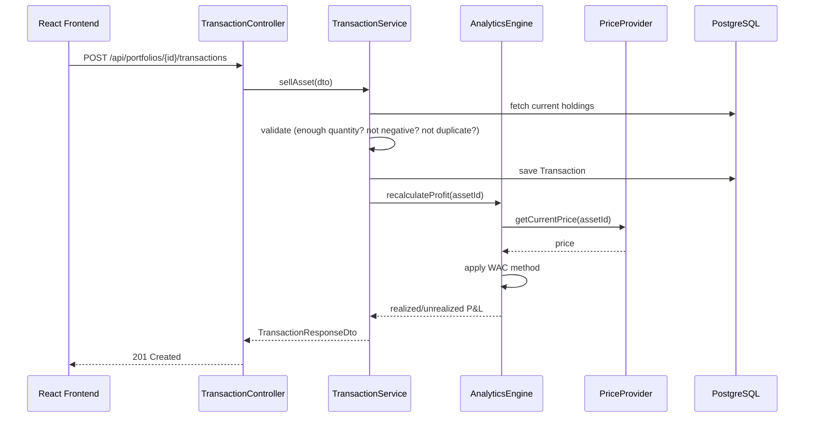
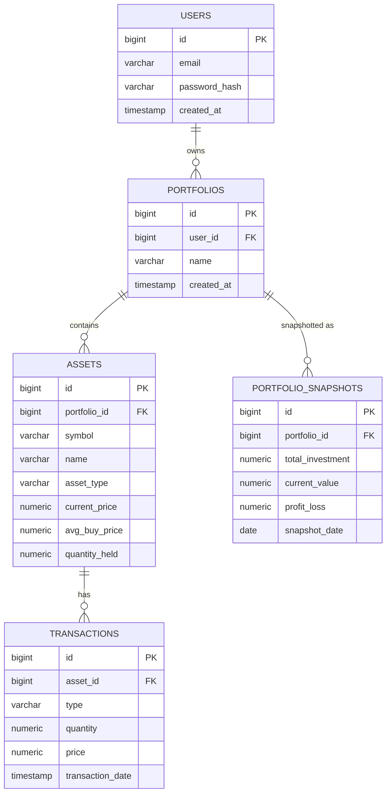

# PortSight — Architecture & Design Document

**Document Version:** 1.0
**Status:** Planning Phase (Phase 1–2)
**Companion to:** `PLANNING.md` (Project Plan / SRS)

---

## 1. Architecture Overview

PortSight follows a strict layered architecture. Each layer only talks to the layer directly below it — the Controller never touches a Repository directly, and the Analytics Engine never touches HTTP concerns.



**Why this shape:**
- **Controller** — HTTP concerns only: request/response mapping, status codes, no business logic.
- **Service** — orchestrates use cases (e.g. "record a SELL transaction": validate → persist → trigger recalculation).
- **Analytics Engine** — pure business/financial logic, isolated so it can be unit-tested without Spring context or a database.
- **Repository** — Spring Data JPA, talks to PostgreSQL only.
- **PriceProvider** — the one seam designed for V2 extension without touching the Analytics Engine.

---

## 2. Backend Design

### 2.1 Request flow (example: recording a SELL transaction)



### 2.2 Key design patterns used

| Pattern | Where | Why |
|---|---|---|
| Strategy | `PriceProvider` interface, `CostBasisStrategy` interface | Swap `ManualPriceProvider` → live feed, or WAC → FIFO, without touching callers |
| DTO + Mapper | Every controller boundary | Entities never leave the service layer; prevents lazy-loading/serialization issues |
| Repository | Spring Data JPA per entity | Standard persistence abstraction |
| Aggregator | `DashboardAggregatorService` | Single service composes output of the four analytics engines into one response, so the frontend makes one call, not four |

### 2.3 Cross-cutting concerns

- **Validation:** Bean Validation (`@Valid`, `@NotNull`, `@Positive`, custom `@ValidQuantity`) on DTOs, enforced before any service logic runs.
- **Exception handling:** a single `@ControllerAdvice` (`GlobalExceptionHandler`) maps domain exceptions (`InsufficientHoldingsException`, `DuplicateTransactionException`, `PortfolioNotOwnedException`) to consistent HTTP error responses.
- **Security:** a JWT filter (`JwtAuthenticationFilter`) runs once per request ahead of the controller layer; ownership checks (a user can only touch their own portfolios) happen in the service layer, not just at the URL level.
- **Logging:** SLF4J with structured log statements at service-layer entry/exit for financial operations (BUY/SELL/snapshot), so a bug can be traced without a debugger.

---

## 3. Frontend Design

### 3.1 Folder structure

```
src/
├── api/                  # Axios instance + one file per resource (portfolioApi.js, transactionApi.js, analyticsApi.js)
├── components/
│   ├── common/           # Button, Card, LoadingSpinner, ErrorBanner
│   ├── dashboard/        # ValuationCard, AllocationChart, GrowthChart, PerformerList
│   ├── portfolio/        # PortfolioList, PortfolioForm
│   ├── asset/            # AssetList, AssetForm
│   └── transaction/      # TransactionForm, TransactionHistoryTable
├── pages/                # Login, Register, Dashboard, PortfolioDetail
├── hooks/                # usePortfolios, useAnalytics, useAuth
├── context/              # AuthContext (holds JWT + current user)
├── routes/               # AppRouter.jsx, ProtectedRoute.jsx
└── utils/                # formatCurrency, formatPercent, date helpers
```

### 3.2 Routing

| Route | Page | Protected? |
|---|---|---|
| `/login` | Login | No |
| `/register` | Register | No |
| `/dashboard` | Dashboard (aggregated analytics) | Yes |
| `/portfolios` | Portfolio list | Yes |
| `/portfolios/:id` | Portfolio detail (assets + transactions) | Yes |

### 3.3 Data flow

- One Axios instance with a request interceptor attaching the JWT, and a response interceptor redirecting to `/login` on 401.
- Each resource has a thin API module (`portfolioApi.getAll()`, `transactionApi.create()`); components never call Axios directly.
- Dashboard page makes **one call** to the aggregated endpoint (`/api/portfolios/{id}/dashboard`) rather than four separate analytics calls — mirrors the backend's `DashboardAggregatorService`.
- Local component state (`useState`) is enough for V1 — no Redux/Zustand needed at this scope; revisit only if state sharing gets genuinely painful.

---

## 4. Database Design

### 4.1 Entities

Users

| Column | Type | Constraints |
|---|---|---|
| id | BIGINT | PK |
| email | VARCHAR(255) | UNIQUE, NOT NULL |
| password_hash | VARCHAR(255) | NOT NULL |
| created_at | TIMESTAMP | NOT NULL |

portfolios

| Column | Type | Constraints |
|---|---|---|
| id | BIGINT | PK |
| user_id | BIGINT | FK → users.id, NOT NULL |
| name | VARCHAR(100) | NOT NULL |
| created_at | TIMESTAMP | NOT NULL |

**assets**

| Column | Type | Constraints |
|---|---|---|
| id | BIGINT | PK |
| portfolio_id | BIGINT | FK → portfolios.id, NOT NULL |
| symbol | VARCHAR(20) | NOT NULL |
| name | VARCHAR(100) | NOT NULL |
| asset_type | VARCHAR(20) | CHECK IN ('STOCK','MUTUAL_FUND') |
| current_price | NUMERIC(18,4) | NOT NULL, manually updated (V1) |
| avg_buy_price | NUMERIC(18,4) | NOT NULL, maintained by WAC logic |
| quantity_held | NUMERIC(18,6) | NOT NULL, DEFAULT 0 |

**transactions**

| Column | Type | Constraints |
|---|---|---|
| id | BIGINT | PK |
| asset_id | BIGINT | FK → assets.id, NOT NULL |
| type | VARCHAR(10) | CHECK IN ('BUY','SELL') |
| quantity | NUMERIC(18,6) | NOT NULL, CHECK (quantity > 0) |
| price | NUMERIC(18,4) | NOT NULL, CHECK (price > 0) |
| transaction_date | TIMESTAMP | NOT NULL |
| created_at | TIMESTAMP | NOT NULL |

**portfolio_snapshots**

| Column | Type | Constraints |
|---|---|---|
| id | BIGINT | PK |
| portfolio_id | BIGINT | FK → portfolios.id, NOT NULL |
| total_investment | NUMERIC(18,4) | NOT NULL |
| current_value | NUMERIC(18,4) | NOT NULL |
| profit_loss | NUMERIC(18,4) | NOT NULL |
| snapshot_date | DATE | NOT NULL |
| | | UNIQUE (portfolio_id, snapshot_date) — prevents duplicate daily snapshots |

### 4.2 Indexing notes

- `assets.portfolio_id`, `transactions.asset_id`, `portfolio_snapshots.portfolio_id` — index every FK used in lookups (Analytics Engine queries by these constantly).
- Composite unique index `(portfolio_id, snapshot_date)` on `portfolio_snapshots` doubles as the duplicate-snapshot guard called out in the NFRs — no extra application-level locking needed.

---

## 5. ER Diagram



---

## 6. Package Structure (Backend)

```
com.portsight
├── PortSightApplication.java
│
├── config
│   ├── SecurityConfig.java
│   ├── SwaggerConfig.java
│   └── SchedulerConfig.java
│
├── security
│   ├── JwtTokenProvider.java
│   ├── JwtAuthenticationFilter.java
│   └── UserDetailsServiceImpl.java
│
├── controller
│   ├── AuthController.java
│   ├── PortfolioController.java
│   ├── AssetController.java
│   ├── TransactionController.java
│   └── DashboardController.java
│
├── service
│   ├── AuthService.java
│   ├── PortfolioService.java
│   ├── AssetService.java
│   └── TransactionService.java
│
├── analytics
│   ├── ValuationEngine.java
│   ├── ProfitEngine.java
│   ├── AllocationEngine.java
│   ├── PerformanceEngine.java
│   ├── DashboardAggregatorService.java
│   └── costbasis
│       ├── CostBasisStrategy.java        # interface
│       └── WeightedAverageCostStrategy.java
│
├── price
│   ├── PriceProvider.java                # interface
│   └── ManualPriceProvider.java
│
├── scheduler
│   └── PortfolioSnapshotJob.java
│
├── repository
│   ├── UserRepository.java
│   ├── PortfolioRepository.java
│   ├── AssetRepository.java
│   ├── TransactionRepository.java
│   └── PortfolioSnapshotRepository.java
│
├── entity
│   ├── User.java
│   ├── Portfolio.java
│   ├── Asset.java
│   ├── Transaction.java
│   └── PortfolioSnapshot.java
│
├── dto
│   ├── request/  (LoginRequest, TransactionRequest, ...)
│   └── response/ (PortfolioResponse, DashboardResponse, ...)
│
├── mapper
│   ├── PortfolioMapper.java
│   ├── AssetMapper.java
│   └── TransactionMapper.java
│
├── exception
│   ├── GlobalExceptionHandler.java
│   ├── InsufficientHoldingsException.java
│   ├── DuplicateTransactionException.java
│   └── PortfolioNotOwnedException.java
│
└── util
    └── FinancialMathUtils.java            # BigDecimal helpers, rounding rules
```

---

## 7. API Overview

### 7.1 Auth

| Method | Endpoint | Description |
|---|---|---|
| POST | `/api/auth/register` | Create a new user |
| POST | `/api/auth/login` | Authenticate, returns JWT |

### 7.2 Portfolio

| Method | Endpoint | Description |
|---|---|---|
| GET | `/api/portfolios` | List current user's portfolios |
| POST | `/api/portfolios` | Create a portfolio |
| GET | `/api/portfolios/{id}` | Get one portfolio (ownership-checked) |
| PUT | `/api/portfolios/{id}` | Update a portfolio |
| DELETE | `/api/portfolios/{id}` | Delete a portfolio |

### 7.3 Asset

| Method | Endpoint | Description |
|---|---|---|
| GET | `/api/portfolios/{portfolioId}/assets` | List assets in a portfolio |
| POST | `/api/portfolios/{portfolioId}/assets` | Add an asset (Stock/MF) |
| PUT | `/api/assets/{id}` | Edit asset details |
| PUT | `/api/assets/{id}/price` | Manually update current price (`ManualPriceProvider`) |
| DELETE | `/api/assets/{id}` | Delete an asset |

### 7.4 Transaction

| Method | Endpoint | Description |
|---|---|---|
| GET | `/api/assets/{assetId}/transactions` | List transactions for an asset |
| POST | `/api/assets/{assetId}/transactions` | Record a BUY or SELL |
| DELETE | `/api/transactions/{id}` | Reverse/delete a transaction (with recalculation) |

### 7.5 Analytics & Dashboard

| Method | Endpoint | Description |
|---|---|---|
| GET | `/api/portfolios/{id}/valuation` | Total investment, current value, return %, daily change |
| GET | `/api/portfolios/{id}/profit` | Realized + unrealized P&L (WAC) |
| GET | `/api/portfolios/{id}/allocation` | Allocation percentages by asset |
| GET | `/api/portfolios/{id}/performance` | Best/worst performer, highest gain |
| GET | `/api/portfolios/{id}/snapshots` | Historical snapshots (for growth chart) |
| GET | `/api/portfolios/{id}/dashboard` | Aggregated response — everything above in one call |

**Total for V1: ~20 endpoints** — matches the earlier target of "15–20 well-designed APIs" rather than the original 40–60 endpoint spec.

---

## 8. Resolved Design Decisions

### 8.1 Cached holdings on the Asset entity

**Decision:** `quantity_held` and `avg_buy_price` are stored on the `Asset` entity as cached values, updated immediately whenever a BUY or SELL transaction is successfully processed.

**Rationale:** Recalculating holdings from the full transaction history on every dashboard read does not scale — with thousands of transactions per asset, this would make the dashboard progressively slower over time. Caching on the Asset row keeps dashboard reads O(1) regardless of transaction volume. Transaction history remains the source of truth for auditing; the cached fields exist purely for fast analytics reads.

**Implementation requirements this creates:**
- The `Transaction` insert and the `Asset` cache update (`quantity_held`, `avg_buy_price`) must occur inside a single `@Transactional` service method. If these ever ran as separate commits, a partial failure would leave the cache silently inconsistent with the ledger — a bug that wouldn't surface until the numbers stop matching.
- Concurrent SELL requests against the same asset are a real race condition (two requests could both read stale `quantity_held` and both pass the "sufficient holdings" check). Use either a pessimistic lock (`SELECT ... FOR UPDATE`) or optimistic locking (`@Version` on `Asset`) when applying a transaction to the cached balance.

### 8.2 No transaction deletion in V1

**Decision:** `DELETE /api/transactions/{id}` is removed from V1 scope. Transactions are append-only.

**Rationale:** Deleting a transaction forces recalculation of holdings, average buy price, realized profit, and unrealized profit — and can retroactively invalidate later SELL transactions that depended on it. Example: BUY 100 @100, BUY 50 @120, SELL 80, then delete the first BUY — every downstream calculation (average price, holdings, profit) becomes inconsistent with what was already reported to the user. This complexity is disproportionate to the value it adds for an MVP.

**V1 correction paths for user mistakes:**
- Delete the entire asset (see cascade behavior below), or
- Recreate the portfolio, or
- (V2) Add an explicit "adjustment" transaction type instead of allowing raw deletion.

**Cascade behavior on asset deletion:** Deleting an `Asset` cascade-deletes its `Transaction` history with it. This is documented as a destructive, non-reversible action — otherwise the same historical-integrity problem transaction deletion was designed to avoid simply reappears one level up, at the asset level.

## 9. Open Items Before Coding Begins

- [ ] Decide locking strategy for concurrent transaction writes on the same asset: optimistic (`@Version`) vs pessimistic (`SELECT ... FOR UPDATE`). Optimistic is simpler to implement and sufficient at V1 traffic levels.
- [ ] Confirm asset deletion requiring a confirmation step in the frontend UI, given it is now a destructive, cascading action.